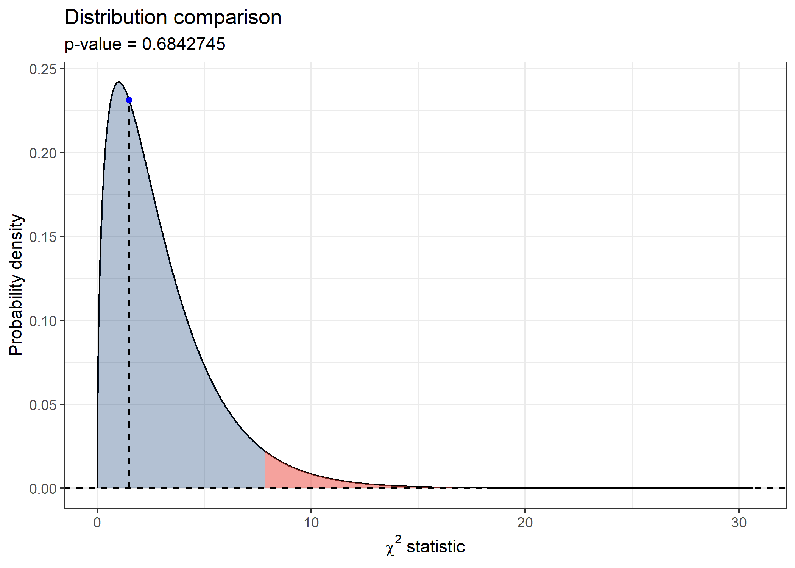
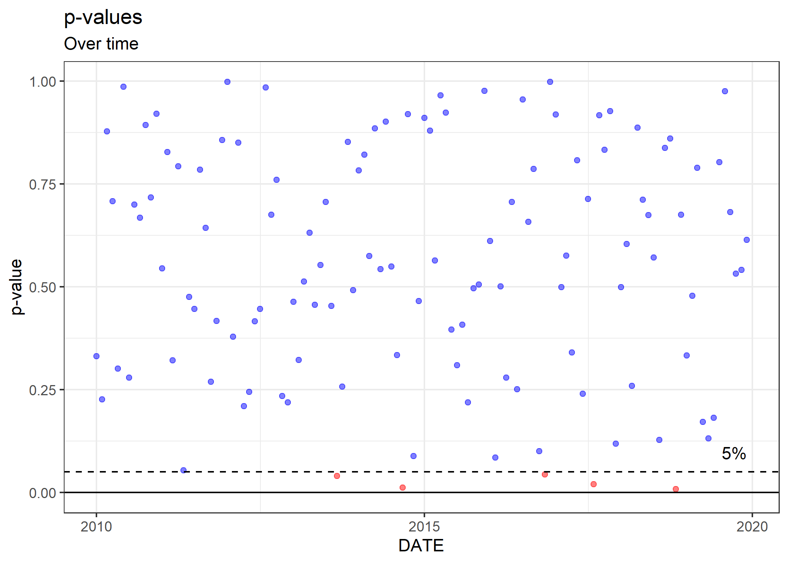
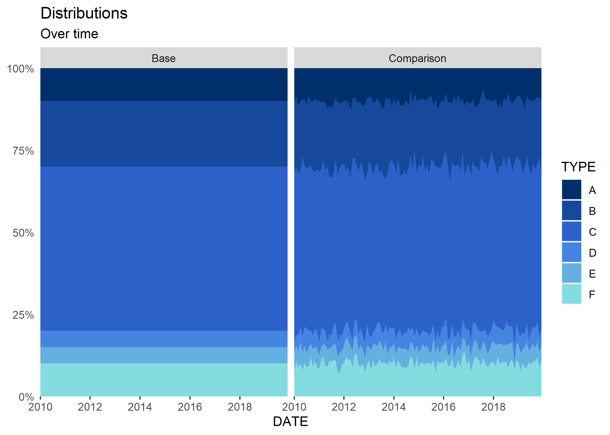

<!-- README.md is generated from README.Rmd. Please edit that file -->

# rpsi

[](https://cran.r-project.org/package=rpsi)
[](https://cran.r-project.org/package=rpsi)
[](https://github.com/edpeyton/rpsi/actions/)
[](https://CRAN.R-project.org/package=rpsi)
[](https://lifecycle.r-lib.org/articles/stages.html)

# Introduction

The population stability index (PSI) is a commonly applied metric to
evaluate how much a (discrete) variable has shifted in distribution over
time. It is widely used in the field of credit risk modelling for
diagnosing changes in the characteristics of a population over time and
the consequential effects on model performance.

Unfortunately, there is a tendency is the field for the importance of
the PSI to be misstated. Practitioners of the PSI (particularly model
validators) often define arbitrary thresholds for the PSI, which when
crossed, they interpret as meaningful indicators of some underlying
change in behaviour.

> These arbitrary thresholds are typically values of 0.02, 0.05, 0.1, etc. and
> are often mapped to outputs of *Very stable*, *Stable*, ..., *Very
> unstable*.

These prescribed values are common in the credit risk literature but are
without justification.

In this package we try to address this blind application of the PSI in
industry by applying the statistical properties (Yurdakul, 2018) that
provide better meaning than those currently perpetuated in the industry.

## Moving away from arbitrary thresholds

Better critical values have already been derived (Yurdakul, 2018). The
PSI was shown to have an approximate *χ*<sup>2</sup> distribution. That
is

``` math
\text{PSI}\sim\chi^{2}_{B-1}\cdot(1/M+1/N)
```

where $B$ is the number of discrete values defining the distributions of
interest and $(M,N)$ are the number of observations in each sample of
interest.

Therefore, it is simple to obtain critical thresholds for a PSI for a
chosen confidence level $\alpha$. In the case above, both distributions are
treated as random. However, there are contexts where the base
distribution is considered to be a population and not a random sample.
In those instances, the expression above simplifies. See (Yurdakul,
2018) for details.

The key thing to note is that a critical value that can be used as a threshold is simply

``` math
CV_{\alpha} = \sim\chi^{2}_{\alpha,B-1}\cdot(1/M+1/N)
```

which is dependent on $M$, meaning that that the critical threshold will change with the sample size of the comparison distribution.

## Using `rpsi`

Using the package is quite simple. The main function is `rpsi::psi(...)`
which takes in two discrete distributions for comparison. See `?rpsi::psi` for details.

### Simple comparison of two distributions
We can start with a simple example with random data:

``` r
library(rpsi)
library(dplyr)

set.seed(1234)

# Generate some data
x = data.frame(x = rnorm(500, 0.1)) %>% mutate(VAL  = factor(ifelse(x< -2,"A", ifelse(x<0, "B", ifelse(x>2, "D", "C"))))) %>% group_by(VAL) %>% summarise(N = n())
y = data.frame(x = rnorm(500, 0.1)) %>% mutate(VAL  = factor(ifelse(x< -2,"A", ifelse(x<0, "B", ifelse(x>2, "D", "C"))))) %>% group_by(VAL) %>% summarise(N = n())

# Calculate the PSI
res = psi(x, y, var = "VAL", count = "N")

print(res)
#> 
#> rpsi object
#> -----------
#> Unique values: A, B, C, D
#> N = 500
#> M = 500
#> B = 4
#> PSI = 1.06e-02
#> p-value = 4.48e-01
#> 99% threshold = 4.54e-02
```

Here the PSI value comes out as 0.0106 and the 99% threshold is 0.0454.

We can also plot a visual representation of the result using the `plot`
method for `rpsi` objects.

``` r
# Plot the result
plot(res, crit_val = 0.95)
```



### Comparison over time
Furthermore, we can perform the comparison between a base distribution
and a comparison distribution over time.

``` r
#Example over time
p = c(0.1, 0.2, 0.5, 0.05, 0.05, 0.1)
N = 10000
```

``` r
# Base distribution
x = data.frame(TYPE = factor(LETTERS[1:length(p)]), VALUE = N*p)
x
#>   TYPE VALUE
#> 1    A  1000
#> 2    B  2000
#> 3    C  5000
#> 4    D   500
#> 5    E   500
#> 6    F  1000
```

``` r
# Comparison distribution over time
y = sapply(seq.Date(as.Date("2010-01-01"), as.Date("2019-12-01"), "month"), 
           function(i) {
             data.frame(TYPE = factor(sample(LETTERS[1:length(p)], 500, replace = TRUE, prob = p))) %>% mutate(DATE = i)
           }, 
    simplify = FALSE) %>% 
  bind_rows() %>% 
  group_by(DATE, TYPE, .drop = FALSE) %>% 
  summarise(VALUE = n(), .groups = "keep") %>% 
  ungroup()

y
#> # A tibble: 720 x 3
#>    DATE       TYPE  VALUE
#>    <date>     <fct> <int>
#>  1 2010-01-01 A        56
#>  2 2010-01-01 B       105
#>  3 2010-01-01 C       244
#>  4 2010-01-01 D        26
#>  5 2010-01-01 E        25
#>  6 2010-01-01 F        44
#>  7 2010-02-01 A        50
#>  8 2010-02-01 B       104
#>  9 2010-02-01 C       241
#> 10 2010-02-01 D        22
#> # ... with 710 more rows
```

``` r
res = psi(x, y, var = "TYPE", count = "VALUE", date = "DATE")
plot(res, crit_val = 0.95)
```







Here we see that the PSI exceeds the threshold at multiple points, despite the comparison sample being generated from the same random variable as the base. The main driver
of this behaviour is the difference in sample sizes between the base and comparison distributions.

### S3 methods for `rpsi` objects

Objects of class `rpsi` have the following S3 methods:

``` r
methods(class = "rpsi")
#> [1] plot    print   summary
#> see '?methods' for accessing help and source code
```

------------------------------------------------------------------------

### Links

Yurdakul, Bilal (2018). Statistical Properties of Population Stability
Index.

------------------------------------------------------------------------

### Contributors

[Ed Peyton](https://github.com/edpeyton)

------------------------------------------------------------------------

<a href="#top">Back to top</a>
